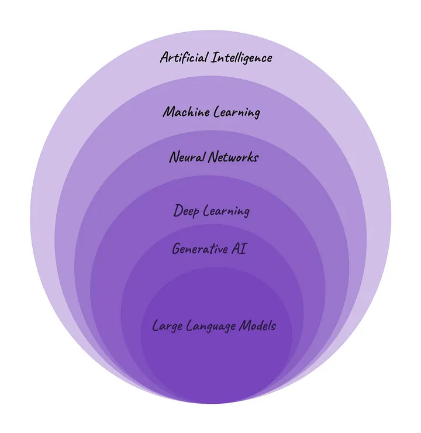

# Foundations

## Background & Hierarchy

AI      → creating machines with human-like thinking and behavior.

ML     → allows computers(machines) to learn patterns from data and make predictions without explicitly programmed.

NN     → mimic the human brain’s structure

DL      → efficient for complex problem-solving 

GenAI → creates diverse content from learned patterns

LLM    → a form of genAI, generating human-like content based on the patterns learned from the large data

## GenAI and LLMs

- GenAI and LLMs have revolutionized the field of AI
- It allows machines to create a diverse content
- Unlike discriminative models, It  generates the new content by learning patterns and relationships
- It is capable of multi-tasking
- The training of genAI involves supervised learning where the model trains based on the data provided by human-created content
- GenAI is not a new concept. It is an updated version of markov model which are initially used for next word predictions.
- The landscape has significantly changed over the years with the generation of more powerful architectures and large datasets.
    - In 2014, GAN(Generative Adversarial Networks) emerged using two models working together. one is for generating output and the other is discriminating real data from the generated output
    - In 2015, Diffusion models were introduced. refining their output iteratively to generate new data samples resembling the training data
    - In 2017, Google introduced Transformer architecture, a advancement in NLP. Transformers encode each word as a token, generating  attention map that refers which tokens are most important.

## LLMs

- LLM stands for Large Language Models
- The ‘Large’ refers to the large scale of these models both in terms of size and architecture and the amount of data that is used to train the model is large
- the ‘Language Models’ refer to the algorithms or systems that are trained to understand and generate human-like content

## Training LLMs

- Training LLMs is a complex task that involves instructing the model to learn and produce human-like text
- Steps involved in training LLMs:
    - Providing Input Text
    - Optimizing Model Weights
    - Fine-tuning Parameter Values
- The performance of LLM is heavily influenced by two key factors:
    - Model architecture
    - Dataset
- Training a LLM demands a high computational resources and expertise
- The duration of the process of training can range from several days to weeks
- After the initial training, LLMs can easily customized for various tasks using small set of datasets. The process usually referred as fine-tuning

## Use Cases

| No. | Use case | Description |
| --- | --- | --- |
| 1 | Content Generation | Craft human-like text, videos, code and images when provided with instructions |
| 2 | Language Translation | Translate languages from one to another |
| 3 | Text Summarization | Summarize lengthy texts, simplifying comprehension by highlighting key points. |
| 4 | Question Answering and Chatbots | LLMs can provide relevant answers to queries, leveraging their vast knowledge |
| 5 | Content Moderation | Assist in content moderation by identifying and filtering inappropriate or harmful language |
| 6 | Information Retrieval | Retrieve relevant information from large datasets or documents. |
| 7 | Educational Tools | Tutor, provide explanations, and generate learning materials. |

## Challenges

## Learning Models

- There are three learning models:
    - Zero Shot Learning - No examples provided for training, though the accuracy may vary
    - Few Shot Learning - Few examples are provided for training, the performance significantly improves
    - Domain Adaption - It extends from few shot, trains the model on a specific application or domain

## Domain Adaption

- While General AI models like chatGPT works very well. But it may inaccurate when you ask in depth queries because they lack of depth in a specific domain.
- This is where domain-adaption LLMs plays crucial role
- These models are trained domain-specific concepts in depth. these are also referred as domain-specific LLMs

## Types of Domain Adaption Methods

- There are several methods to incorporate domain-specific knowledge into LLMs
    - Domain-Specific Pre-Training
    - Domain-Specific Fine-Tuning
    - RAG (Retrieval Augmented Generation)

### Domain-Specific Pre-Training

- It involves training LLMs with large datasets that contains language and characteristics of a particular domain.

- The training corpus is divided into half domain-specific and  half general-purpose information to leverage both advantages of general LLM and domain-specific LLM
- It takes several days to weeks for training

### Domain-Specific Fine-Tuning

- It is a process of refining the pre-existing LLM for a particular task or a specific domain
- It trains the general LLM with a specific data to improve the performance of the LLM in a specific domain
- It takes minutes to hours for training

### RAG (Retrieval Augmented Generation)

- It enhances the quality of responses generated by LLMs by incorporating up-to-date and takes data from external resources during the generation process

- Three components that represents the RAG pipeline
    - **Ingestion** - data is divided into chunks and embeddings stored in an index
    - **Retrieval** - by the index of embeddings, the system retrieves top k documents when a query is received
    - **Synthesis** - Examining the data that is retrieved from sources and generate accurate results

## Where and What to Use?

